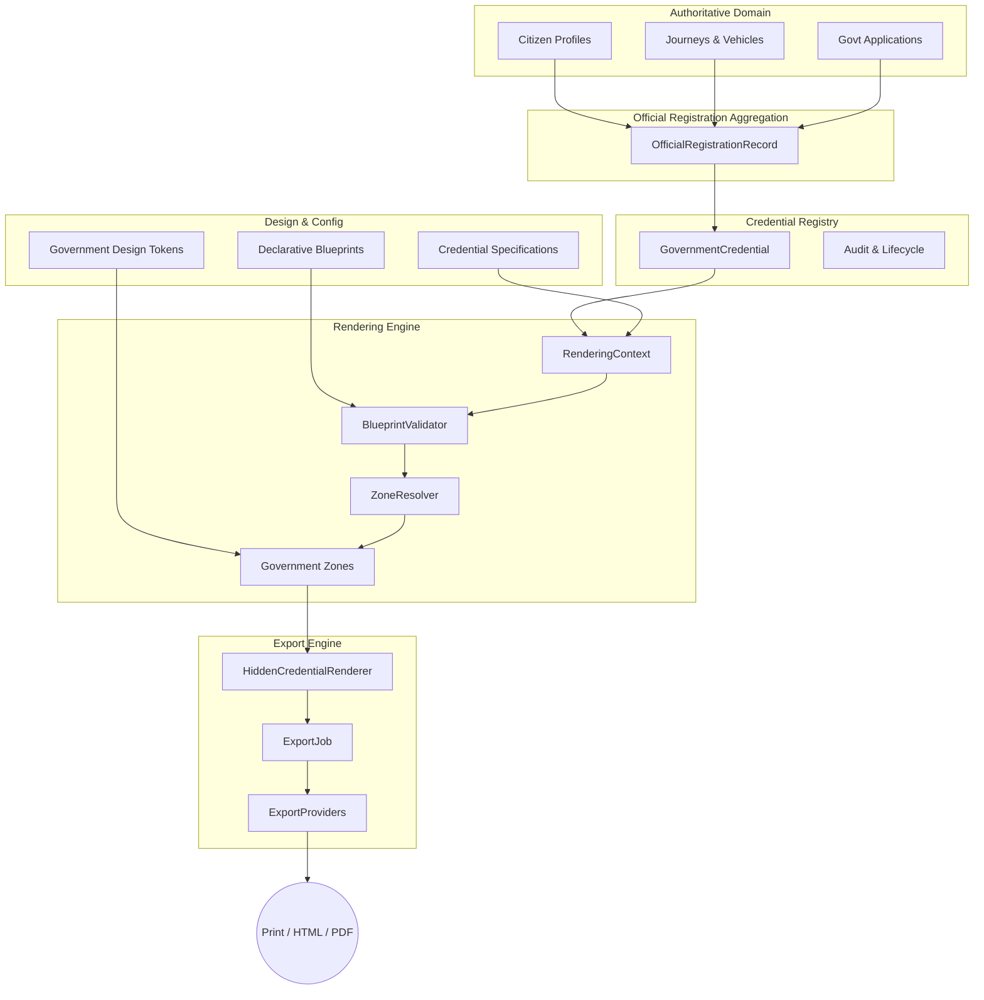

# Mahakumbh Smart Pilgrim Management Platform
## Architecture Freeze Document (Version 1.0)

**Date:** July 2026
**Version:** 1.0 (Frozen)
**Status:** OFFICIAL GOVERNANCE REFERENCE

---

## 1. Project Overview

The **Mahakumbh Smart Pilgrim Management Platform** is a highly scalable, government-grade information system designed to manage millions of citizen registrations, journeys, and official accommodations during the Mahakumbh festival.

A central pillar of this platform is the **Government Credential Framework**. It is responsible for dynamically generating, rendering, and exporting secure, immutable government documents (e.g., Registration Certificates, Pilgrim Identity Cards, Vehicle Passes) directly from authoritative citizen data. The framework ensures that all output adheres strictly to a unified Government Design Language, guaranteeing visual consistency, security, and data integrity across all touchpoints.

---

## 2. Architecture Status

With the release of Version 1.0, the foundational layers of the application are officially **frozen**. The following modules are considered stable and must not undergo major restructuring or redesign without a major version increment:

- **Core Platform:** Citizen Domain, Journey Domain, Government Applications
- **Data Aggregation:** Official Registration Aggregation Model
- **Credential Infrastructure:** Credential Registry, Government Credential Lifecycle
- **Design System:** Government Design Language, Government Document Zones, Credential Specifications, Print Profiles
- **Rendering Pipeline:** Declarative Credential Blueprints, Rendering Engine
- **Export Pipeline:** Export Engine, Export Providers
- **Security:** QR Foundation
- **Storage:** Credential Repository

---

## 3. Architectural Principles

All future development must adhere to the following core principles established in Version 1.0:

1. **Single Source of Truth:** Official documents must NEVER become the primary source of citizen data. All credentials are dynamically generated from the normalized domain models (Citizen, Journey).
2. **Separation of Concerns:** Data aggregation, visual layout (Blueprints), rendering (Engine), and output generation (Export) are strictly isolated from one another.
3. **Configuration over Hardcoding:** Layouts, visibility rules, and rendering behaviors are driven by declarative configuration files rather than conditional component logic.
4. **Declarative Blueprints:** Document layouts are defined by lightweight, declarative blueprints indicating zone order and visibility conditions.
5. **Reusable Components:** The Government Design System provides standardized, immutable visual tokens and zones.
6. **Immutable Core Architecture:** Core models and engines are frozen. New requirements must be met via extension, not modification.
7. **Adapter Pattern:** Export targets (Print, PDF, HTML) are handled via pluggable `ExportProviders` ensuring the core engine remains output-agnostic.
8. **Context-driven Rendering:** Zones are resolved dynamically based on the current `RenderingContext` and `RenderProfile`.
9. **Validation before Rendering:** The engine guarantees blueprint compliance with the `CredentialSpecification` before executing a render.
10. **Rendering before Exporting:** The Rendering Engine is the absolute single producer of layouts; exporters solely consume rendered credentials.

---

## 4. Module Dependency Diagram

---

## 5. Frozen Public Contracts

The following TypeScript interfaces, types, and abstractions are the public contracts of Version 1.0. They are stable and act as the foundation for all extension points.

- `CredentialSpecification`: Defines security, zones, and metadata for a specific credential type.
- `OfficialRegistrationRecord`: The standardized, aggregated view of citizen and journey data.
- `GovernmentCredential`: The immutable record of an issued document (including versioning and audit trails).
- `RenderingContext` & `RenderingManifest`: The state data required to render a credential and the resulting validated layout plan.
- `CredentialBlueprint`: The declarative layout structure linking Zones to rendering rules.
- `ZoneVisibilityCondition`: The configuration-driven ruleset dictating component visibility.
- `RenderProfile` & `RenderMode`: Context flags defining who is viewing the document and how.
- `ExportManifest` & `ExportJob`: State data tracking the configuration and lifecycle of an export process.
- `ExportProvider`: The interface for plugging in new export adapters.

---

## 6. Approved Extension Points

The architecture is designed to grow laterally through well-defined extension points:

- **New Credential Types:** Introduce new enums, define a new `CredentialSpecification`, and author a `DeclarativeBlueprint`.
- **New Export Providers:** Implement the `ExportProvider` interface (e.g., `ClientPdfProvider`, `ServerPdfProvider`) and register it with the `ExportEngine`.
- **New Verification Providers:** Extend the QR foundation to support new cryptographic or visual verification standards.
- **Localization:** Inject new locale data into the `RenderingContext` to leverage multi-language layouts.
- **Digital Signatures:** Extend the `ExportManifest` to include PKI signing workflows.
- **Wallet & DigiLocker Integration:** Implement adapters targeting external API serialization.
- **Backend Services & Mobile Applications:** Consume the frozen domain models via API bridges.

---

## 7. Non-Goals (Out-of-Scope for v1.0)

Version 1.0 establishes the client-side foundation. The following features are explicitly **out of scope** for this release and are deferred to future phases:

- Cryptographic Digital Signatures (PKI/eSign)
- Server-side PDF Rendering (e.g., Puppeteer/Playwright generation)
- Offline Verification Protocols
- Native DigiLocker API Integration
- Push Notifications and SMS gateways
- Real-time Backend Database Integrations / API Gateways
- Advanced Administrative Workflows and Approval Dashboards

---

## 8. Versioning Policy

Architectural changes will be strictly governed:
- **Minor Updates (v1.x):** Adding new credential types, implementing new export providers, refining UI components, or extending context data. These must not break existing contracts.
- **Major Updates (v2.x):** Any modification that alters the core Rendering Pipeline, restructures the Aggregation Model, changes the fundamental `GovernmentCredential` structure, or breaks backward compatibility of the frozen public contracts.

---

## 9. Next Development Roadmap

With the foundation secured, development should proceed through the following strategic phases:

- **Phase 3:** Government Verification Platform (QR scanning, status validation)
- **Phase 4:** Citizen Document Center (Citizen-facing portal for viewing/managing issued documents)
- **Phase 5:** Administrative Portal (Government-facing dashboards for approval and auditing)
- **Phase 6:** Backend & API Layer (Cloud synchronization, permanent storage, auth)
- **Phase 7:** Mobile Applications (React Native / PWA client integrations)
